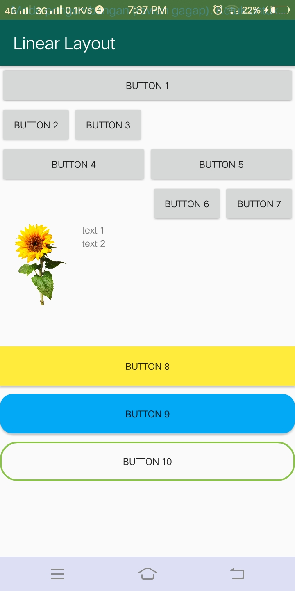

<h2>SOAL PRODUKTIF</h2>
<h5>1. Berikan penjelasan dari perbedaan linear layout, relative layout, dan constrain layout.</h5>
<h5>2. Jelaskan method onCreate dan onPause pada activity.</h5>

<h2>JAWABAN</h2>
<h5><h/5>
<h5>
  Linear Layout adalah jenis layout dimana user menempatkan 1 objek per baris atau kolom secara sejajar. Jadi di dalam setiap baris atau kolom hanya ada 1 objek yang bisa ditempatkan . Linear Layout ini ada dua jenis . Yaitu :
•	Linear Layout Vertical (Objek per baris/kesamping) 
•	Linear Layout Horizontal (Objek per kolom/kebawah)

  <h/5>
<h5>
  Relative Layout adalah jenis layout yang memiliki karakteristik dalam menempatkan view secara relatif. Relatif disini berarti posisi dari setiap view bergantung kepada view yang lain. Simplenya adalah, kita bebas untuk menempatkan objek yang diinginkan sesuka hati kita. Penempatan satu objek bisa dimana saja mau di sisi kanan, kiri, atas, ataupun bawah dari objek lain. Jika tidak di tetapkan, maka objek dapat menumpuk antara satu objek dengan objek yang lain.
  <h/5>
<h5>
  Constrain Layout memungkinkan kita membuat tata letak yang besar dan kompleks dengan tampilan datar. Ini hampir mirip dengan Relative Layout karena semua tampilan ditata berdasarkan hubungan antara satu objek dengan yang lain, tetapi lebih fleksibel daripada RelativeLayout dan lebih mudah digunakan dengan Editor Layout Android Studio.
  <h/5>
<h5>
  Dari ketiga layout tersebut maka kita bisa mengambil kesimpulan bahwa setiaplayout memiliki keunggulan dan kekurangan masing-masing, linear layout bisa mengikuti ukuran layar handphone yang berbeda-beda tanpa merubah susuan objek, relative layout hanya akan terlihat sesuai dengan apa yang telah ditetapkan sebelumnya jika ukuran layar berubah bisa saja objek ada yang terpotong atau bahkan tidak terlihat, sedangkan constraint layout itu lebih flexible dan mudah untuk dibuat.
  <h/5> 
    

<h2>MATERI 1: LINEAR LAYOUT</h2>

<h5>* Sebuah Style adalah kumpulan properti yang menetapkan penampilan dan format untuk View. 
Style bisa menetapkan properti seperti tinggi, pengisi, warna font, ukuran font, warna latar belakang, 
dan banyak lagi yang lainnya. Gaya didefinisikan di Style.xml(Res--> Values -->style.xml) yang terpisah dari XML yang menetapkan layout.</h5>
<h5>* Sebuah tema adalah style yang diterapkan pada keseluruhan Activity atau aplikasi, bukannya View individual (seperti dalam contoh di atas).</h5>

